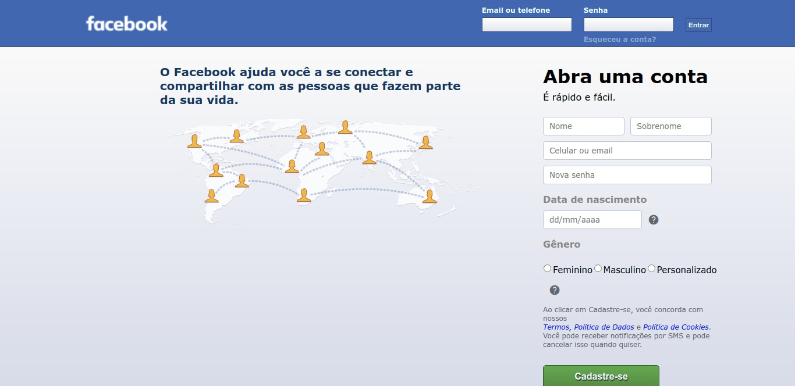

<h1 align="center">
  
</h1>

<h3 align="center">
  Curso realizado na Trybe - Edu Souza o/
</h3>

<blockquote align="center">“Nunca permita que o medo domine sua vontade de vencer.”</blockquote>

<h4 align="center">
  Repositório - Pagina inicial do facebook
</h4>

 

  &nbsp;
  &nbsp;
  

  <a href="#rocket-Sobre-o-projeto">Sobre o projeto</a>&nbsp; &nbsp; |&nbsp; &nbsp;
  <a href="#postbox-Entrega"">Entrega</a>&nbsp; &nbsp; |&nbsp; &nbsp;
  <a href="#unlock-Licença">Licença</a>

## :rocket: Sobre o projeto

#### Pagina inicial do facebook

Hoje vamos recriar um icônico layout que a maioria de vocês já devem ter visto! Estamos falando da tela de cadastro do Facebook.

O Facebook é a rede social mais acessada do mundo, com uma audiência de mais de 2.3 bilhões de usuários por mês. Espantoso, não? Para recriar a página inicial do Facebook, você vai precisar muito das skills de HTML, CSS e JavaScript que aprendeu até aqui.

#### Screenshots:

   &nbsp;

## :postbox: Entrega

#### :clipboard: Requisitos

- 
<a href="#1"> :pushpin: 1.</a> Crie uma barra azul na parte superior da página com a classe top-bar.

- 
<a href="#2"> :pushpin: 2.</a> A barra superior deve conter o logotipo do Facebook no canto esquerdo com a classe facebook-logo.

- 
<a href="#3"> :pushpin: 3.</a> A barra superior deve conter um formulário de autenticação no canto direito.

- 
<a href="#4"> :pushpin: 4.</a> Crie uma classe no CSS chamada form-group.

- 
<a href="#5"> :pushpin: 5.</a> Adicione um subcontainer com a classe form-group para agrupar o rótulo e campo "E-mail ou telefone" dentro do formulário criado na etapa 3.

- 
<a href="#6"> :pushpin: 6.</a> Adicione um subcontainer com a classe form-group para agrupar o rótulo e campo "Senha" dentro do formulário criado na etapa 3.

- 
<a href="#7"> :pushpin: 7.</a> Adicione um subcontainer com a classe form-control com o botão "Entrar" dentro do formulário criado na etapa 3.

- 
<a href="#8"> :pushpin: 8.</a> Crie um container com a classe main-content abaixo da barra azul para agrupar o conteúdo principal da página.

- 
<a href="#9"> :pushpin: 9.</a> Crie um subcontainer com a classe left-content para colocar o conteúdo do lado esquerdo dentro do container com a classe main-content.

- 
<a href="#10"> :pushpin: 10.</a> Crie um subcontainer com a classe right-content para colocar o conteúdo do lado direito dentro do container com a classe main-content.

- 
<a href="#11"> :pushpin: 11.</a> Crie um campo de entrada de texto para o nome do usuário dentro do formulário criado no requisito 10.

- 
<a href="#12"> :pushpin: 12.</a> Crie um campo de entrada de texto para o sobrenome do usuário dentro do formulário criado no requisito 10.

- 
<a href="#13"> :pushpin: 13.</a> Crie um campo de entrada de texto para o celular ou email do usuário dentro do formulário criado no requisito 10.

- 
<a href="#14"> :pushpin: 14.</a> Crie um campo de entrada para senha do usuário dentro do formulário criado no requisito 10.

- 
<a href="#15"> :pushpin: 15.</a> Crie um campo de entrada para data de nascimento do usuário dentro do formulário criado no requisito 10.

- 
<a href="#16"> :pushpin: 16.</a> Crie um campo de entrada para gênero do usuário dentro do formulário criado no requisito 10.

- 
<a href="#17"> :pushpin: 17.</a> Crie um botão para finalizar o cadastro dentro do formulário criado no requisito 10.

- 
<a href="#18"> :pushpin: 18.</a> Validar se todos os campos foram preenchidos ao clicar no botão "Cadastre-se".

- 
<a href="#19"> :pushpin: 19.</a> Adicione um novo campo de texto no formulário se a pessoa usuária selecionar a opção "Personalizado" no campo Gênero.

- 
<a href="#20"> :pushpin: 20.</a> Substituir o conteúdo do container com a classe right-content se o formulário estiver completamente preenchido e validado.

### Concluído :rocket:

Acesse o deploy do projeto [aqui](https://edusouza-programmer.github.io/Trybe_Projeto_6-6_Edu_Souza/).

#
## :unlock: Licença

Este projeto está licenciado sob a Licença MIT - consulte [LICENSE](https://opensource.org/licenses/MIT) para maiores detalhes.
